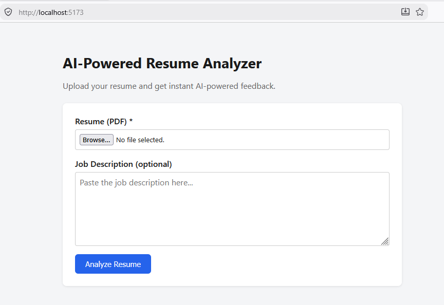
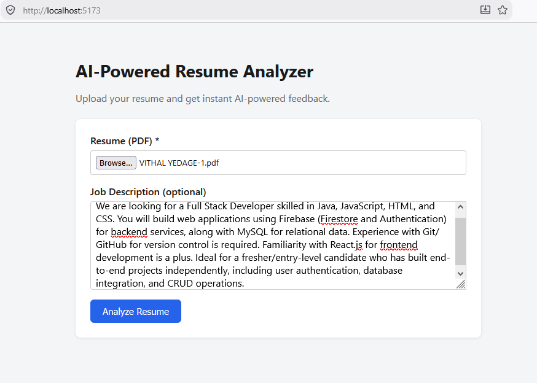
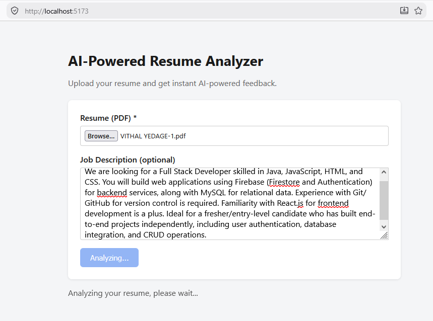
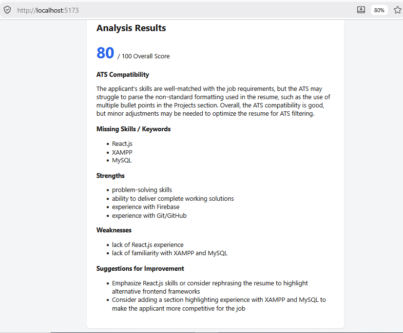
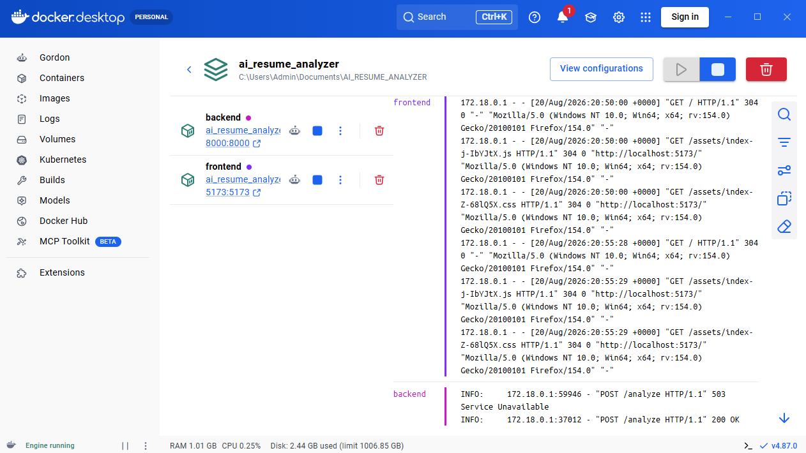
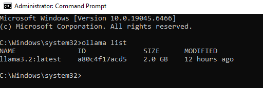
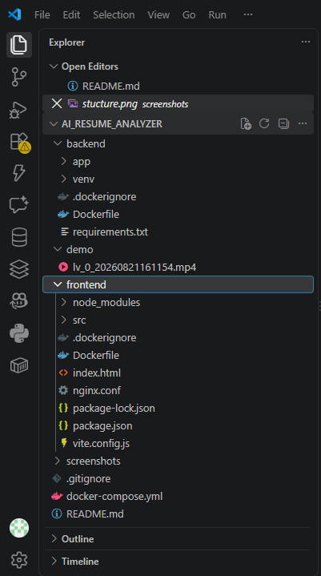

# AI-Powered Resume Analyzer

AI-Powered Resume Analyzer is a local web application for reviewing resumes with an optional job description. Users upload a resume PDF and receive AI-generated feedback including an overall score, ATS compatibility assessment, missing skills, strengths, weaknesses, and suggestions for improvement.

The application uses a locally hosted Ollama model, so no resume or job description is sent to a cloud AI service.

## Features

- Upload a resume in PDF format.
- Optionally provide a job description for targeted analysis.
- Extract text from text-based PDFs with `pdfplumber`.
- Generate structured feedback with the local `llama3.2` Ollama model.
- Display an overall score from 0 to 100.
- Identify ATS compatibility, missing skills, strengths, weaknesses, and suggestions.
- Show loading and error states in a single-page interface.
- Keep processing local without a database or cloud AI API.

## Architecture

The application uses a client-server architecture:

```text
User (Browser)
    |
    v
React + Vite frontend
(Nginx in Docker, port 5173)
    |
    | HTTP REST multipart/form-data request
    v
FastAPI backend
(Docker, port 8000)
    |
    +--> pdfplumber extracts resume text
    |
    +--> Ollama API
         http://host.docker.internal:11434
                |
                v
         llama3.2 generates structured JSON
                |
                v
         FastAPI validates and returns the analysis
                |
                v
         React renders the results
```

Ollama runs on the host machine rather than inside Docker. The backend container reaches the host service through `host.docker.internal`.

## Technology Stack

| Layer | Technology | Justification |
|---|---|---|
| Frontend | React | Provides a component-based interface for upload, loading, error, and results states. |
| Frontend tooling | Vite | Provides fast development and production builds. |
| Production serving | Nginx | Efficiently serves the built frontend from its Docker container. |
| Backend | Python and FastAPI | Provides a lightweight REST API with request validation and interactive documentation. |
| PDF processing | pdfplumber | Extracts text from standard text-based PDF resumes. |
| Backend HTTP client | requests | Sends analysis requests from the backend to Ollama. |
| Local AI | Ollama with `llama3.2` | Runs inference locally without a cloud AI dependency. |
| Containerization | Docker and Docker Compose | Packages and starts the frontend and backend services consistently. |

## Prerequisites

Install the following before running the project:

| Tool | Requirement |
|---|---|
| Docker Desktop | Version 4.x or later, with the WSL2 backend enabled on Windows |
| Docker Compose | Version 2, included with Docker Desktop |
| Ollama | Installed and running locally |
| Ollama model | `llama3.2` pulled locally |

Python and Node.js do not need to be installed on the host because they run inside the Docker containers.

## Ollama Setup

1. Install Ollama from [ollama.com](https://ollama.com/download).
2. Pull the model used by the application:

```bash
    ollama pull llama3.2
```

3. Confirm that the model is available and Ollama is reachable:

```bash
    ollama list
```

You should see `llama3.2` in the output. Ollama normally runs in the background after installation.

## Build & Run Instructions

1. Confirm that Ollama is running:

```bash
    ollama list
```

2. Start Docker Desktop and wait until it shows **Engine running**.
3. Navigate to the project root:

```bash
    cd AI_RESUME_ANALYZER
```

4. Build and start both services. Use this command the first time:

```bash
    docker compose up --build
```

    For subsequent runs, use:

```bash
    docker compose up
```

5. Open the application at [http://localhost:5173](http://localhost:5173).
6. Stop the services with `Ctrl+C`, or run this command from another terminal:

```bash
    docker compose down
```

## API

The backend exposes a REST API on port `8000`.

### `GET /health`

Returns the backend health status.

**Response:**

```json
{
  "status": "ok"
}
```

### `POST /analyze`

Analyzes an uploaded resume, optionally against a job description.

**Request:** `multipart/form-data`

| Field | Type | Required | Description |
|---|---|---|---|
| `resume` | PDF file | Yes | The text-based resume PDF to analyze. |
| `job_description` | Text | No | Optional job description for targeted skill matching. |

**Example request:**

```bash
curl -X POST http://localhost:8000/analyze \
  -F "resume=@resume.pdf" \
  -F "job_description=Looking for a Python developer with Docker experience"
```

**Example response:**

```json
{
  "overall_score": 78,
  "ats_compatibility": "The resume is reasonably well structured for ATS parsing.",
  "missing_skills": [
    "Docker",
    "Cloud platforms (AWS/Azure)"
  ],
  "strengths": [
    "Clear project descriptions",
    "Relevant technical skills listed"
  ],
  "weaknesses": [
    "No quantified achievements",
    "Missing summary keywords"
  ],
  "suggestions": [
    "Add measurable outcomes to each project",
    "Include a professional summary with target keywords"
  ]
}
```

Interactive API documentation is available at [http://localhost:8000/docs](http://localhost:8000/docs).

## Usage

1. Open [http://localhost:5173](http://localhost:5173) in a browser.
2. Select a resume PDF.
3. Optionally paste a job description.
4. Select **Analyze Resume**.
5. Wait for the local model to complete the analysis. Processing commonly takes 30 to 90 seconds, depending on the machine.
6. Review the score, ATS compatibility assessment, missing skills, strengths, weaknesses, and suggestions.

## Screenshots

### Upload Form


### Job Description Input


### Analyzing State


### Analysis Results


### Docker Containers Running


### Ollama Running


### Project Structure


## Demo Video

[Watch the demo video](demo/demo-video.mp4)
## Testing

The following manual test cases cover the primary workflows and error states:

| # | Test case | Expected result |
|---|---|---|
| 1 | Upload a valid resume without a job description. | A complete analysis is returned successfully. |
| 2 | Upload a valid resume with a job description. | Missing skills reflect comparison with the job description. |
| 3 | Upload a non-PDF file. | A clear error states that only PDF files are accepted. |
| 4 | Submit without selecting a resume. | Frontend validation prevents the request and shows an error. |
| 5 | Analyze while Ollama is not running. | The backend returns a clear connection error. |
| 6 | Analyze while `llama3.2` is not installed. | The backend returns a clear model-not-found error. |
| 7 | Upload a scanned or image-only PDF. | The application reports that no extractable text was found. |
| 8 | Upload an empty PDF file. | The application reports that the uploaded file is empty. |

## Assumptions

- The resume is a text-based PDF. OCR is not implemented.
- Only the `llama3.2` Ollama model is used; there is no model selector in the UI.
- Ollama is installed and running on the host machine.
- The application is intended for local or demo use.
- No authentication, database, or persistent analysis history is required.

## Limitations

- Scanned or image-only PDFs are not supported because OCR is not implemented.
- Analysis history is not stored because the application has no database or persistent storage.
- Analysis quality depends on the capabilities of the local Ollama model.
- Response time varies with hardware; CPU-based analysis typically takes 30 to 90 seconds or longer.
- Ollama must run on the host machine rather than inside Docker.

## Troubleshooting

| Issue | Likely cause | Resolution |
|---|---|---|
| Could not connect to Ollama | Ollama is not running. | Start Ollama and verify it with `ollama list`. |
| Model not found | `llama3.2` has not been pulled. | Run `ollama pull llama3.2`. |
| Docker build fails with disk errors | Docker does not have enough disk space. | Free disk space and clean unused Docker resources. |
| Frontend loads but analysis does not complete | The backend cannot reach Ollama from Docker. | Confirm that Ollama is running and the backend uses `http://host.docker.internal:11434`. |
| Port 5173 or 8000 is already in use | Another process owns the port. | Stop the conflicting process or update the Docker Compose port mapping. |
| No extractable text found | The PDF is scanned or image-only. | Use a text-based PDF; OCR is outside the current scope. |